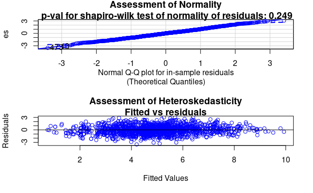

```{r set-up, include=FALSE}
knitr::opts_chunk$set(echo = FALSE)
library(tidyverse)
library(mice)
library(knitr)
library(ggplot2)
library(GGally)
library(randomForest)
ggplot2::theme_set(ggplot2::theme_bw())
```

## Introduction

As the second largest city in Europe and the center of art in 18th century, Paris witnessed a lot of auctions on paintings. The most important aspect that all people in auctions would consider is the price. Then the question aries:  What could drive the prices of paintings? This project aims to use model fitting methods to find out what factors could affect the price of paintings in 18th century Paris by using the dataset containing information of paintings with auction price data from 1764-1780 on the sales, painters and other characterisitcs of paintings. 

In the dataset, each line represents a painting. Each column represents a feature of the painting including the year of sale, width, height, surface area, the author. The original dataset is not clean enough for a statistical analysis. Before we start analyzing, we first cleaned the dataset and impute missing values for several variables by assuming missing completely at random and using "Mice" package that would assign values of missing cells based on existing data. To conduct the analysis, we took the logarithm of prices of each painting and set it as the response variable in all models we tried. 

Before implementing different models, we applied exploratory data analysis by drawing scatterplots and boxplots to find out what variables might be related with the price that would give us some ideas of what variables to include in the model. We first fitted a linear model by selecting predictors only based on EDA. We set our initial linear model to contain all selected predictors with all possible two-way interactions. Then we used BIC (Bayesian Information Criterion) to conduct model selection and build a parsimonious model. This simple model would provide us with some ideas about the variables.

Besides only applying results of EDA, we then used Random Forest to choose important variables and then combine results of EDA to form a new set of predictors. Then we apply complex models including simple linear model, BMA (Bayesian Model Averaging), BART (Bayesian Additive Regression Tree), Random Forest, and GAM (Generalized Additive Model) to compare which model could give us the best predictions in terms of RMSE(root mean squared error) and coverage etc.. Predictors and interactions in this final model would give us information about which features or combinations of features would influence the price of paintings so that people could find the most valuable paintings. 


## Exploratory data analysis

We first checked how many predictors in the original data have missing data. We noticed that `type_intermed`, `Diam_in`, `Surface_Rnd` and `authorstyle` are largely missing, and therefore excluded these predictors from model building. We noticed that many variables have missing or unknown values, and used `mice` to impute the missing values based on the values of the other variables. The following exploratory data analysis is based on the imputed training data set.

```{r read-data}
load("paintings_train.Rdata")
load("paintings_test.Rdata")
load("paintings_validation.Rdata")
```

```{r}
# clean data
clean_data <- function(data) {

  data %>%
  mutate_each(function(x){ifelse(x %in% c(""," ", NA, "n/a", "-"), NA, x)}) %>%
    mutate(Shape = ifelse(Shape == "ovale", "oval",
                          ifelse(Shape == "ronde", "round", Shape))) %>%
    mutate(Surface=log(Surface+1)) %>%
    mutate_at(vars(c(dealer, origin_author:diff_origin, winningbiddertype:type_intermed,
                     material:materialCat, Shape, engraved:other, artistliving)), as.factor) %>%
    select(-c(Diam_in, Surface_Rnd, type_intermed, authorstyle)) %>%
    select(-c(sale,lot,subject,authorstandard,author,winningbidder,price,
              winningbiddertype, material, mat))
}

paintings_train_clean <- paintings_train %>% clean_data()
paintings_test_clean <- paintings_test %>% clean_data()
paintings_validation_clean <- paintings_validation %>% clean_data()
```

```{r, eval = F}
# imputation
impute_data <- function(data) {

  data %>%
    mice(m = 1, nnet.MaxNWts = 10000, seed = 9, maxit = 50) %>%
    complete(action = 1) %>%
    mutate(origin_author = relevel(fct_collapse(origin_author, O = c("A","G","X")), ref = "O"))

}

paintings_train_imputed <- impute_data(paintings_train_clean)
paintings_test_imputed <- impute_data(paintings_test_clean)
paintings_validation_imputed <- impute_data(paintings_validation_clean)
```

```{r}
# save(paintings_train_imputed, file="paintings_train_imputed.Rdata")
# save(paintings_test_imputed, file="paintings_test_imputed.Rdata")
# save(paintings_validation_imputed, file="paintings_validation_imputed.Rdata")

# load imputed data for faster knit
load("paintings_train_imputed.Rdata")
load("paintings_test_imputed.Rdata")
load("paintings_validation_imputed.Rdata")
```

To identify the best variables for predicting `logprice`, we want to examine the relationships between `logprice` and the other variables. Since there are too many predictors, we look at quantitative, binary and numeric predictors separately. We first create a scatterplot matrix for the quantitative predictors. We noticed that `position` is in percentage, but some of the paintings have values larger than 1, suggesting that these were recorded wrong. We took log() of `Surface` when cleaning the data, and therefore its distribution is not skewed in the plot. The above plot also shows that, `Height_in`, `Width_in`, `Surface_Rect` need transformation, since their distributions are skewed. 

```{r numeric-eda, message = F, warning = F, fig.width=6, fig.height=4, fig.pos="H"}
paintings_numeric <- paintings_train_imputed %>% select_if(is.numeric) 

p_numeric <- ggpairs(paintings_numeric,
             upper = list(continuous = wrap("points", size = 0.1, alpha = 0.5)),
             lower = list(combo = wrap("facethist", binwidth = 100)),
             progress = F)
temp <- lapply(c(1:p_numeric$ncol)[-3], function(i) getPlot(p_numeric, 3, i))
ggpubr::ggarrange(plotlist = temp) %>% 
  ggpubr::annotate_figure(top = "Relationship between logprice and numeric predictors")
```

We decided to use `Surface` in our model, because we suspect that paintings with large surface area would be sold at a higher prices. We also wanted to use `year` as a predictor, since the plot shows that `logprice` fluctuates with `year`.  
The following is a scatterplot matrix for the binary variables in the data set. The plot shows that we might be able to predict `logprice` based on the variables `diff_origin`, `engraved`, `prevcoll`, `finished`, `lrgfont` and `still_life`. 

```{r binary-eda}
paintings_binary <- paintings_train_imputed %>%
  select(logprice, diff_origin, artistliving, Interm, engraved, original, prevcoll,
         othartist, paired, figures, finished, lrgfont, relig, landsALL, lands_sc,
         lands_elem, lands_figs, lands_ment, mytho, peasant, othgenre, singlefig, portrait, other)

p_binary <- ggpairs(paintings_binary,
             upper = list(continuous = wrap("box_no_facet", size = 0.5, alpha = 0.5)),
             lower = list(combo = wrap("facethist", binwidth = 100)),
             progress = F)
temp <- lapply(c(1:p_binary$ncol)[-1], function(i) getPlot(p_binary, 1, i))
ggpubr::ggarrange(plotlist = temp[1:12]) %>% 
  ggpubr::annotate_figure(top = "Relationship btw logprice and binary predictors")
ggpubr::ggarrange(plotlist = temp[13:23])
```

The scatterplot matrix between `logprice` and categorical variables with fewer categories suggest that we could consider all these variables to predict `logprice`.

```{r factor-eda, message = F, warning = F, fig.width=6, fig.height=3, fig.pos="H"}
paintings_more_factor <- paintings_train_imputed %>%
  select(logprice, dealer, origin_cat, school_pntg, endbuyer, materialCat, Shape)

p_more_factor <- ggpairs(paintings_more_factor,
             upper = list(continuous = wrap("box_no_facet", size = 0.5, alpha = 0.5)),
             lower = list(combo = wrap("facethist", binwidth = 100)),
             cardinality_threshold = 28,
             progress = F) 
temp <- lapply(c(1:p_more_factor$ncol)[-1], function(i) getPlot(p_more_factor, 1, i))
ggpubr::ggarrange(plotlist = temp) %>% 
  ggpubr::annotate_figure(top = "Relationship btw logprice and qualititave predictors") 
```

The following plot investigates the popular school of paintings sold over the years.

```{r, warning = F, fig.width=6, fig.height=3, fig.pos="H"}
paintings_train_imputed %>% select(c(logprice, year, school_pntg)) %>% 
  filter(school_pntg %in% c("D/FL", "F", "I", "X")) %>% 
  group_by(school_pntg, year) %>% count() %>% 
  ggplot( aes(x=year, y=n, group=school_pntg, fill=school_pntg)) +
    geom_area(alpha = 0.1) +
    stat_smooth(geom = 'area', method = 'loess', span = 1/3,
                alpha = 0.5, fill = "blue") + 
    scale_fill_viridis_d() +
    theme(legend.position="none") +
    ggtitle("Popular Schools of Paintings Sold from 1765 to 1780") +
    ylab("number of paintings sold") +
    #theme_ipsum() +
    theme(
      legend.position="none",
      panel.spacing = unit(0.1, "lines"),
      strip.text.x = element_text(size = 8)
    ) +
    facet_wrap(~school_pntg, scale="free_y")
```

The following line graph indicates that dealer R sold paintings at a higher price over the years, while dealer J sold at a lower price over the years. 

```{r, fig.width=6, fig.height=3, fig.pos="H"}
paintings_more_factor <- paintings_train_imputed %>%
  select(logprice, dealer, origin_cat, school_pntg, endbuyer, materialCat, Shape, year)
bydealer <- paintings_more_factor %>%
  select(logprice, dealer, year) %>%
  group_by(year,dealer) %>%
  summarise(logprice = mean(logprice)) %>%
  ggplot() + geom_point(aes(x = year, y = logprice, color = dealer), size = 2) +
  geom_line(aes(x = year, y = logprice, color = dealer), size = 1) + theme_bw() +
  labs(title = "Average logprice for each dealer by year")
bydealer
```

Beyond what plotted above, there are some variables, such as `lot`, `authorstandard`, `winningbidder`, whose relationships to `logprice` are hard to visualize because they contain too many categories. We decided not to use them from our initial model building. Based on the EDA, we selected the 10 best variables for predicting `logprice`:  
  - Numerical: `Surface`, `year`  
  - Binary: `diff_origin`, `engraved`, `prevcoll`, `finished`, `lrgfont`, `still_life`  
  - Other qualitative: `dealer`, `origin_author`


## Discussion of preliminary model Part I

```{r echo=FALSE}
kable(data.frame("Bias" = "263.996", "Coverage" = "0.953", "maxDeviation" = "12960.579",
           "MeanAbsDeviation" = "481.893", "RMSE" = "1269.146"))
```

The above table shows the leader board results we got for our OLS model in Part I. Based on the result, our model in Part I already performed really well. Also, according at the summary table, all variables are statistically significantly.

```{r echo=FALSE}
kable(data.frame("Training RMSE" = "1513.434", "Test RMSE" = "1269.146"))
```

By looking at the RMSE for both the training set and the test set, we can further confirm its well performance. Since the model in Part I performed well, we will keep OLS as an option. Further development could be done by choosing variables using Random Forests and fitting into other complex models such as Random Forests, GAM, BAM and BART. We will compare different model results according to their coverage, bias, RMSE, maximum deviation and mean absoulte deviation in order to determine our final model.


## Development of the final model

To make our model more complex, we fitted both linear models such as BMA and nonlinear models including GAM, Random Forest and BART to the paintings data set. Based on the model evaluation, BART performed the best and thus we chose BART as our final model. 

```{r, warning = F, message=FALSE}
painting_train_best <- paintings_train_imputed %>%
  select(logprice, engraved, year, lrgfont, dealer, diff_origin, Surface, origin_cat,
         finished, Interm, prevcoll, paired, materialCat, artistliving, singlefig, lands_elem,
         relig, portrait, still_life)

painting_test_best <- paintings_test_imputed %>% 
  select(logprice, engraved, year, lrgfont, dealer, diff_origin, Surface, origin_cat,
         finished, Interm, prevcoll, paired, materialCat, artistliving, singlefig, lands_elem,
         relig, portrait, still_life)

painting_validation_best <- paintings_validation_imputed %>% 
  select(logprice, engraved, year, lrgfont, dealer, diff_origin, Surface, origin_cat,
         finished, Interm, prevcoll, paired, materialCat, artistliving, singlefig, lands_elem,
         relig, portrait, still_life)
```

```{r, warning = F, message = F, results = 'hide'}
set.seed(9)
options(java.parameters="-Xmx5000m") # must be set initially
library(bartMachine)
set_bart_machine_num_cores(16)

Y <- painting_train_best$logprice
X <- painting_train_best %>% select(-c(logprice))
X_test <- painting_test_best %>% select(-c(logprice))

bart <- bartMachine(X, Y, num_trees=20, seed=9)
```

##### Final model

We provide plots of importance of variables and interactions for BART model since we cannot generate a summary table of coefficients like other linear models. Even though we can not present exact coefficients of our predictor variables and interactions, we could find their relative importance in our model. As we can see above, numerical variables; `Surface` and `year` have been included more frequently than other factor variables. In addition, two-way interaction terms including numerical variables are more frequent than other two-way interaction terms. The other thing we could find through above plots was that variance in interaction terms' including probability which indicated by red line on each bar were much larger than each individual variable.

```{r message=F, error=FALSE, fig.width=7, fig.height=5, fig.pos="H"}
investigate_var_importance(bart)
  abline(v = 2.6, col = "blue", lwd = 3)
interaction_investigator(bart, num_replicates_for_avg=2)
  abline(v = 8.6, col = "blue", lwd = 3)
```

```{r, fig.width=6}
post_y <- bart_machine_get_posterior(bart, X_test)
top4 <- as.data.frame(t(post_y$y_hat_posterior_samples[rank(post_y$y_hat)>745, ,drop = F])) %>%
  select(V4, V1, V3, V2)
par(mfrow=c(2,2))
for(i in 1:4){
  plot(density(x = exp(top4[,i])), type = "l", main = "posterior predictive density of Top4", xlab = paste("Top",i))
  }
```

In addition to variable importance, we could find posterior predictive distributions of our test set which make it possible to quantify uncertainty. When we consider the most expensive paintings in train sets are `29000`, `25800`, `20000`, and `17535`, the above posterior predictive distributions seem to capture the features in our dataset.


##### Variable selection 

To improve our model in Part I and make our model more complex, we decided to include more variables in our model based on the variables we selected from EDA. Therefore, we tried systematic methods to select variables that we use in final model at first. Among 44 candidate variables, we arbitrarily choose top 28 important variables whose importance was measured by Random Forest. 

```{r rf-varimp, warning = F, fig.width=6, fig.height=5, fig.pos="H"}
rf <- randomForest(
  logprice ~ .,
  data=paintings_train_imputed
)

# make dataframe from importance() output
feat_imp_df <- importance(rf) %>%
  data.frame() %>%
  mutate(feature = row.names(.))

# choose the best features
best_feat <- feat_imp_df %>% arrange(desc(IncNodePurity)) %>% .[1:28,2]

# plot dataframe
ggplot(feat_imp_df, aes(x = reorder(feature, IncNodePurity), 
                         y = IncNodePurity)) +
    geom_bar(stat='identity') +
    geom_vline(xintercept = 15.5, color = "red")+
    coord_flip() +
    theme_classic() +
    labs(
      x   = "Feature",
      y   = "Importance",
      title = "Feature Importance: <RF>"
    )
```

To reflect the result from EDA, we included `still_life` and `finished`. However, if we use too many variables, there are potential problems such as unstability of design matrix or overfitting to training set. Thus, we excluded similar variables to prevent multicollinearity; `material`, `winningbidder`, `endbuyer`,`Surface_Rect`, `land_sc`, and `land_figs`. As a result, we had 26 candidate variables. We examine collinearity further to make our model stable. 

```{r, warning = F, fig.width=8, fig.height=6, fig.pos="H"}
painting_train_best <- paintings_train_imputed %>%
  select(logprice, engraved, year, lrgfont, dealer, diff_origin, Surface, Height_in, Width_in, origin_author,
         origin_cat, finished, Interm, school_pntg, prevcoll, paired, materialCat, artistliving, singlefig, lands_elem,
         relig, portrait, still_life)
pred_mat <- model.matrix(lm(logprice ~., data = painting_train_best))
cormat <- pred_mat %>% as.matrix %>% cor(use = "na.or.complete")
# Heatmap plot
reshape2::melt(cormat) %>% ggplot(., aes(Var1, Var2)) + geom_tile(aes(fill = value)) +
  scale_fill_distiller(direction=1, palette = "RdBu", limits = c(-1,1), na.value = "white") +
  theme(axis.text.x = element_text(size=10, angle=90),
        axis.text.y = element_text(size=10),
        axis.ticks = element_blank()
        ) +
  xlab("Variables") +
  ylab("Variables")
```

In above plot which indicates correlation between predictor variables, we could find `school_pntg`, `origin_cat` and `origin_author` are correlated each other closely. Moreover, `Height_in`, `Width_in`, and `Surface` are also correlated closely. Therefore, we decided to exclude simliar variables `school_pntg` and `origin_author` and keep `origin_cat`. Among `Surface`, `Width_in`, and `Height_in`, we decided to keep `Surface` because we thought that `Surface` can represent the others well. As a result, selected variables for final models are shown below:

```{r, warning = F, message=FALSE}
painting_train_best <- paintings_train_imputed %>%
  select(logprice, engraved, year, lrgfont, dealer, diff_origin, Surface, origin_cat,
         finished, Interm, prevcoll, paired, materialCat, artistliving, singlefig, lands_elem,
         relig, portrait, still_life)
kable(matrix(colnames(painting_train_best)[-1],nrow=6), 
      caption = "selected variable by RF, EDA, and correlation check")
```


##### Residual

```{r pressure, echo=FALSE, out.width = '100%'}

```


From the normal Q-Q plot, we can see that all residuals were perfectly followed a straight line indicated normality. Also, from the fitted vs. residuals plot, all residuals were equally spread around the horizontal line indicated linearity. Thus, our model met the general assumptions.

##### Discussion of how prediction intervals obtained

We used the function `calc_prediction_intervals` in the package `bartMachine` to constrcut the 95% confidence interval for our model. This function returns a matrix of the lower and upper bounds of the prediction intervals for each observation in the test data. We then exponentiated the prediction values, the upper and lower bound values back to its original units and putted into the appropriate data frame format for evaluation.

```{r}
# prediction
pred <- predict(bart, X_test)
pred_int <- calc_prediction_intervals(bart, X_test, pi_conf = 0.95, num_samples_per_data_point = 1000)

predictions = data.frame(
  fit = exp(pred),
  lwr = exp(pred_int$interval[,1]),
  upr = exp(pred_int$interval[,2]))
save(predictions, file="predict-test.Rdata")
```

```{r}
# prediction
X_validation <- painting_validation_best %>% select(-c(logprice))
pred_validation <- predict(bart, X_validation)
pred_int_validation <- calc_prediction_intervals(bart, X_validation, pi_conf = 0.95, num_samples_per_data_point = 1000)

predictions = data.frame(
  fit = exp(pred_validation),
  lwr = exp(pred_int_validation$interval[,1]),
  upr = exp(pred_int_validation$interval[,2]))
save(predictions, file="predict-validation.Rdata")
```


## Assessment of the final model

##### Model Evaluation

The plot of actual versus fitted values indicates that the fitted values from our BART model is reasonably close to the actual responses on the scale of log(price). Notice that the fitted values are slightly higher than the actual values for lower prices, and slightly lower than the actual values for higher prices, suggesting that our BART model tends to over-predict the prices of the paintings when the actual prices are relatively low, and under-predict the prices the paintings when the actual prices are very high. 

```{r, fig.width=4, fig.height=4, fig.pos="H"}
plot_y_vs_yhat(bart)
```

The following plot is a histogram of the posterior estimates of the error variance from the Gibbs samples. The y-axis is the posterior estimate of the error variance. Notice that the error estimates are quite small, which are desirable. 

```{r, fig.width=4, fig.height=4, fig.pos="H"}
plot(get_sigsqs(bart))
```

We only explored the partial dependences for the 2 numerical predictors `Surface` and `year`. The following partial dependence plot shows the partial marginal contribution of `log(Surface)`. Since the partial effects do not include 0, and increase with an increasing surface area, the plot shows that `Surface` contributes quite a lot to the prices of paintings. 

```{r, message = F, fig.width=6, fig.height=4, fig.pos="H"}
pd_plot(bart, "Surface")
```

The partial dependence plot below shows the partial marginal contribution of `year`. Since the partial effects do not include 0, and increase as the year increases, the plot shows that `year` also contributes quite a lot to the prices of paintings. 

```{r, message = F, fig.width=6, fig.height=4, fig.pos="H"}
pd_plot(bart, "year")
```


##### Model Testing

BART combines the advantage of boosting by decreasing the residuals from the previous trees fitted, and increases the size of tree without suffering from overfitting. The overall performance of our BART model is good, as can be seen from the following summary table:

```{r}
mod_perf_tbl <- data.frame(
  Bias = 177.967,
  Coverage = 0.964,
  maxDeviation = 12708.829,
  MeanAbsDeviation = 456.433,
  RMSE = 1237.631
) 
row.names(mod_perf_tbl) <- "BART"
kable(mod_perf_tbl)
```

We achieved a very low bias and RMSE, suggesting that our BART model can make very accurate predictions. The bias is low, meaning that error introduced by approximating the model by our BART model is small. The RMSE is also small, which indicates that the variances of our residuals are also small. The coverage of our model is 0.964, which achieves a quite high predictive coverage. Both the low RMSE and high coverage indicate that our BART model is adequate. In addition to BART, we also tested other models including OLS linear regression model, BMA, GAM and Random Forest. We included a summary table of the model performances in the later sections of our report. 


##### Model Result

We predicted the price of paintings based on the validation data, and ranked predicted price from the highest to the lowest and summarized the information of top 10 paintings according to the variable importance of the bart model. The results are shown in the table below: 

```{r}
top10_paintings <- paintings_validation_imputed %>% 
  mutate(`Predicted Price` = predictions$fit) %>% 
  select(year, dealer, paired, diff_origin, `Predicted Price`) %>% 
  arrange(desc(`Predicted Price`)) %>% .[1:10,]
kable(top10_paintings)
```

It's found that most valueable paintings are sold in year 1777. All top 10 paintings are involved with dealer R. Almost all paintings are sold or suggested as not a pairing for another. In addition, the origins of all paintings based on nationality of artists are the same the origins of paintings based on dealers' classification in the catalogue. We don't observe significant trend in top 10 paintings, but it might contribute a lot to the price for the rest of paintings. 

The highest predicted price is around 14000. It's found that year, surface, dealer, paired, diff_origin are important variables to predict the price of paintings.


## Conclusion

##### Summary of Results
```{r}
bart = rbind(c(197.946, 0.964, 12708.830, 440.461, 1219.663))
ols = rbind(bart, c(206.970, 0.947, 13774.245, 472.354, 1252.426))
bma = rbind(ols, c(218.632, 0.945, 13871.023, 474.235, 1263.940))
rf = rbind(bma, c(335.079, 0.899, 15610.293, 449.551, 1323.228))
table = rbind(rf, c(130.507, 0.237, 26822.439, 534.276, 1772.144))
colnames(table)=c("Bias", "Coverage", "maxDeviation", "MeanAbsDeviation", "RMSE")
rownames(table)=c("BART","Random Forest","BMA","OLS", "GAM")
kable(table)
```

To find the factors that would drove the prices of paintings, we cleaned the dataset and imputed for missing values. We started from a simple linear model that only includes predictos selected according to the EDA to give us some ideas of potential relationship between the price and other features. We then fit complex models which are linear model, BMA, BART, Random Forest and GAM with predictors selected from results of Random Forest and EDA for a better performance. The tested performance is listed in the above table. By taking account all information in the table, we choose BART as our final model.

Even if we cannot interprete coeffcients of variables in the model like what we did in linear models, we still find some important features that could make prices of paintings high. It's found that numerical variables including `Surface` and `year` have significant effects on prices. Paintings sold in later years tend to have a higher price. Large surface area could improve price, and the effect is not that obvious and significant. We also find if dealer R is involved, the price would be higher. In addition, paintings with higher price tend to have the same origin based on nationality of artists as the origin based on dealers' classification in the catalogue. Also, it's better not a be paired with another painting. In conclusion, to get a painting with higher price, people should choose a painting that's sold in later years, with comparatively bigger surface area and not be paired with others. It's also better to have dealer R, and origins of authors and dealer's catalogues are the same. Among all of features, `year` is the most important one.

##### Discussion of thing learned

* **Clean the data and use "mice" to impute for missing values?**
Cleaning data is always the first step of statistical analysis. It took us a long time to figure out what each variable represents, how to code variables in the desired type including removing redundant information such as strange symbols and relevel factors as needed. A tidy dataset is always the foundation of a good model analysis. Since the dataset in the real life is often messy or not in the format we prefer, we need to spend more time making the data frame as clean and efficient as possible. One common problem that we always encounter is that there're missing values in several variables. At the beginning, we considerd training NA as a new level for factor variables. For numeric variables, we tried to use the median to replace NAs of that variable. This method could save time. However, it doesn't make sense when we interprete our results for this new level, since the data doesn't actually have this category. The final method we adopted is to use "mice" package to impute missing values according to other columns. In this way, we neither generate new levels nor randomly assign values. All imputed values are based on our existing information, which would keep the bias as low as possible.

* **How to effectively choose variables in the model?**
Exploratory data analysis is the first step to know the relationship between variables. The first set of predictors we chose for the simple linear model comes from EDA. We could use AIC or BIC to select important interactions after we have some desired predictors. For further analysis, we could use complex models including BMA and random forest that could generate the marginal inclusion probability or the importance plot showing what variables could be considered as important. After comparing and combing predictors selected by different methods, we could refine the set of predictors that would be very likely to generate a good model.

* **Effects of collinearity between variables**
We should remove some variables that're obviously dependent. For example, `Width_in` and `Surface`. We might need to remove one of them. For some variables that are hard to see correlations directly, we need to draw some plots to find if there're some related predictors. The performance of models would be significantly improved if all predictors in the final model are independent.

* **Advantages of BART model**
Although it's difficult to interpret the BART model, BART could handle overfitting. In general, it seems that tree models might perform well in this project. 

##### Recommendations and suggestions
If we have more time, we would try other models such as Ridge and Lasso to see their performances. Moreover, we would try to learn more about package bartMachine and try to tune the BART model to get a better result. We would also try to improve the random forest model and try bagging and boosting to see if these models could perform even better. Finally, we don't use the predictor "author" in the dataset since there're too many authors, but authors could be intuitively thought as closely related with the price of paintings. Thus, there might be a need to clean variable "author", regroup it and include it in the analysis.


