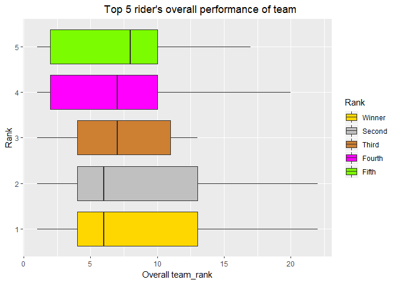

## Packages


```r
if(!require(gganimate)) install.packages("gganimate")
if(!require(transformr)) install.packages("transformr")
if(!require(gifski)) install.packages("gifski")
library(tidyverse)
library(gganimate)
library(transformr)
library(gifski)
```

## Data


```r
tdf <- readRDS(file = "tdf_2019.rds")
```


### Task 1 {.tabset .tabset-fade .tabset-pills}

#### Code {- .tabset .tabset-fade .tabset-pills}
__I made nested list flatten and converted into data.frame which consist of 3696 observations and 63 variables.__

```r
org_df <- function(data){
  temp <- map_dfr(map(data,unlist),as.list)
  return(temp)
}
org_ls_df <- function(var){
  if(typeof(var) == "list") var <- org_df(var)
  return(var)
}
org_merge <- function(temp1,temp2){
  if(length(temp1) > length(temp2)) colnames(temp2) <- paste("team",colnames(temp2),sep = ".") else
    colnames(temp1) <- paste("team",colnames(temp1),sep = ".")
  result <- full_join(temp1,temp2)
  return(result)
}
org_stage <- function(data){
  temp <- map(data,org_ls_df)
  temp2 <- temp[names(temp) %in% c("competitors","teams") == F]
  temp3 <- org_merge(temp$competitors,temp$teams)
  end <- cbind.data.frame(temp2,temp3,stringsAsFactors = F)
  return(end)
}
org_fin <- function(x){
  index <- !map_lgl(x,is.list)
  temp <- x[index]
  temp2 <- map_if(org_stage(x[["stage"]]),is.factor,as.character)
  end <- cbind.data.frame(temp,temp2,stringsAsFactors = F)
  return(end)
}
tdf_df <- map_dfr(tdf,org_fin)
```

__After flattening, I selected required variable in final dataset, and changed their names into required format.__


```r
tdf_df_task1 <- tdf_df %>% 
  mutate(rider_name = name, rider_nat = nationality, team_name = team.name, 
         team_nat = team.nationality, stage = description, dep_city = departure_city, 
         arr_city = arrival_city, classification = classification, distance = distance, 
         start_date = scheduled, time = result.time, time_rank = result.time_ranking, 
         sprint_pts = result.sprint, sprint_rank = result.sprint_ranking, 
         climb_pts = result.climber, climb_rank = result.climber_ranking, 
         young_rider_time = result.young_rider, young_rider_rank = result.young_rider_ranking) %>% 
  select(rider_name, rider_nat, team_name, team_nat, stage, dep_city, arr_city, classification,
         distance, start_date, time, time_rank, sprint_pts, sprint_rank, climb_pts, climb_rank, 
         young_rider_time, young_rider_rank)

tdf_df_task1 <- tdf_df_task1 %>% 
  mutate(stage = as.integer(str_remove(stage,"Stage "))) %>% 
  mutate(distance = as.double(str_replace_all(distance,",","."))) %>% 
  mutate(start_date = as.Date(map_chr(str_split(start_date,"T"),`[[`, 1))) %>% 
  mutate_at(vars(contains("rank")),funs(as.integer)) %>% 
  mutate_at(vars(contains("pts")),funs(as.double))
```

#### Result{- .tabset .tabset-fade .tabset-pills}


```r
head(tdf_df_task1)
```

```
         rider_name   rider_nat           team_name     team_nat stage
1   Teunissen, Mike Netherlands  Team Jumbo - Visma  Netherlands     1
2      Sagan, Peter    Slovakia    Bora - Hansgrohe      Germany     1
3       Ewan, Caleb   Australia        Lotto Soudal      Belgium     1
4  Nizzolo, Giacomo       Italy Team Dimension Data South Africa     1
5  Colbrelli, Sonny       Italy    Bahrain - Merida      Bahrain     1
6 Matthews, Michael   Australia         Team Sunweb  Netherlands     1
  dep_city arr_city classification distance start_date      time time_rank
1 Brussels Brussels           Flat    194.5 2019-07-06  04:22.47         1
2 Brussels Brussels           Flat    194.5 2019-07-06 +00:00.00         2
3 Brussels Brussels           Flat    194.5 2019-07-06 +00:00.00         3
4 Brussels Brussels           Flat    194.5 2019-07-06 +00:00.00         4
5 Brussels Brussels           Flat    194.5 2019-07-06 +00:00.00         5
6 Brussels Brussels           Flat    194.5 2019-07-06 +00:00.00         6
  sprint_pts sprint_rank climb_pts climb_rank young_rider_time
1         50           1        NA         NA             <NA>
2         50           2        NA         NA             <NA>
3         20           7        NA         NA         04:22.47
4         18           8        NA         NA             <NA>
5         33           3        NA         NA             <NA>
6         27           4        NA         NA             <NA>
  young_rider_rank
1               NA
2               NA
3                1
4               NA
5               NA
6               NA
```


### Task 2 {- .tabset .tabset-fade .tabset-pills}

#### Task 2.1 {- .tabset .tabset-fade .tabset-pills}

##### Code {- .tabset .tabset-fade .tabset-pills}

```r
sum_time <- function(x){
  num1 <- na.omit(x)[1]
  index <- !is.na(x) & x != num1
  x[index] <- x[index] + num1
  return(x)
}

trans_time <- function(data,time_var){
  temp1 <- data %>%   
    separate(time_var, sep = "[\\:\\.]", into = c("h","m","s")) %>% 
    mutate_at(vars("h","m","s"),funs(as.numeric)) %>% 
    select(stage,h,m,s)
  
  temp2 <- temp1 %>% 
    group_by(stage) %>% 
    mutate_at(vars("h","m","s"),funs(sum_time))
  
  result <- temp2 %>% 
    mutate(h = (h + m %/% 60) + (m %% 60 + s %/% 60) %/% 60, 
           m = (m %% 60 + s %/% 60) %% 60, 
           s = s %% 60) %>% 
    unite(col = "h:m", sep = ":", h:m, na.rm = T) %>% 
    unite(col = "time", sep = ".", `h:m`:s, na.rm =T)
  
  result <- result %>% 
    mutate(time = na_if(time,"NA:NA.NA"))
  
  return(result$time)
}

tdf_df_task2.1 <- tdf_df_task1 %>% 
  mutate(time = trans_time(data = tdf_df_task1, time_var = "time")) %>% 
  mutate(young_rider_time = trans_time(data = tdf_df_task1, time_var = "young_rider_time"))
```

##### Result {- .tabset .tabset-fade .tabset-pills}


```r
tdf_df_task2.1 %>% 
  select(time,young_rider_time) %>% 
  head(20)
```

```
      time young_rider_time
1  4:22.47             <NA>
2  4:22.47             <NA>
3  4:22.47          4:22.47
4  4:22.47             <NA>
5  4:22.47             <NA>
6  4:22.47             <NA>
7  4:22.47             <NA>
8  4:22.47             <NA>
9  4:22.47             <NA>
10 4:22.47             <NA>
11 4:22.47             <NA>
12 4:22.47             <NA>
13 4:22.47             <NA>
14 4:22.47             <NA>
15 4:22.47          4:22.47
16 4:22.47             <NA>
17 4:22.47          4:22.47
18 4:22.47             <NA>
19 4:22.47             <NA>
20 4:22.47             <NA>
```

#### Task 2.2 {- .tabset .tabset-fade .tabset-pills}

##### Code{- .tabset .tabset-fade .tabset-pills}


```r
tdf_df_task2.temp <- tdf_df_task2.1 %>% 
  pivot_wider(id_cols = rider_name, names_from = stage, names_prefix = "stage_",
              values_from = climb_pts) %>% 
  map_df(replace_na,0)
tdf_df_task2.2 <- tdf_df_task2.temp %>% 
  mutate(total_climb_pts = apply(tdf_df_task2.temp[,-1],1,sum)) %>% 
  mutate(rank = rank(-total_climb_pts,ties.method = "min")) %>% 
  arrange(desc(total_climb_pts))
tdf_df_task2.2 <- tdf_df_task2.2 %>% 
  select(rider_name, rank, stage_1:total_climb_pts)  %>% 
  slice(1:30)
```

##### Result{- .tabset .tabset-fade .tabset-pills}


```r
tdf_df_task2.2
```

```
# A tibble: 30 x 24
   rider_name  rank stage_1 stage_2 stage_3 stage_4 stage_5 stage_6 stage_7
   <chr>      <int>   <dbl>   <dbl>   <dbl>   <dbl>   <dbl>   <dbl>   <dbl>
 1 Bardet, R~     1       0       0       0       0       0       0       0
 2 Bernal, E~     2       0       0       0       0       0       0       0
 3 Wellens, ~     3       0       0       7       0      10      26       0
 4 Caruso, D~     4       0       0       0       0       0       0       0
 5 Nibali, V~     5       0       0       0       0       0       0       0
 6 Yates, Si~     5       0       0       0       0       0       0       0
 7 Quintana,~     7       0       0       1       0       0       0       0
 8 Pinot, Th~     8       0       0       0       0       0       2       0
 9 Lutsenko,~     9       0       0       0       0       0       0       0
10 Kruijswij~    10       0       0       0       0       0       0       0
# ... with 20 more rows, and 15 more variables: stage_8 <dbl>,
#   stage_9 <dbl>, stage_10 <dbl>, stage_11 <dbl>, stage_12 <dbl>,
#   stage_13 <dbl>, stage_14 <dbl>, stage_15 <dbl>, stage_16 <dbl>,
#   stage_17 <dbl>, stage_18 <dbl>, stage_19 <dbl>, stage_20 <dbl>,
#   stage_21 <dbl>, total_climb_pts <dbl>
```

### Task 3 {- .tabset .tabset-fade .tabset-pills}

__Getting championship of Tour de France is very huge honor for bicycling riders. Since Tour de France is toughest edurance event and high-level event, I wondered which factors affect the result of event. In visualization, Top 5 riders were used and compared to each factors. There are three candidate factors.__

__First, the pace of riders over all stages. I decided to examine this factor by time_rank for each stage because it shows relative velocity. I had tried to examine actual velocity of riders, but they are so subtle that it couldn't be represented by visualization.__

__Second, the performance of team of each stage. Since, Tour de France is mixed sports which is consist of team and individual sports, team performance cannot help affecting the overall result of game. To examine this factor, team_rank of overall stages is used.__

__Third, the type of riders. Threr are about two types of course in bicycling: Flat course and moutain course. Rider who has strength in flat course is called Sprinter. On the other hand, rider who has strength in mountain course is called climber. I examined ability of rider in each courses by using their sprint point and climb point. Of couse, rider who are good at both course would win the race. But I wanted to know which factor has more effect on the race. __

#### Code {- .tabset .tabset-fade .tabset-pills}

```r
time_sum <- function(x){
  if(sum(is.na(x)) > 2) return(NA)
  temp <- na.omit(x)
  temp2 <- map(temp, str_split, "[\\:\\.]")
  temp3 <- data.frame(matrix(as.numeric(unlist(temp2)),ncol = 3, byrow = T))
  temp4 <- apply(temp3,2,sum)
  s <- temp4[3] %% 60
  m <- (temp4[2] %% 60 + temp4[3] %/% 60) %% 60
  h <- temp4[1] + temp4[2] %/% 60 + (temp4[2] %% 60 + temp4[3] %/% 60) %/% 60
  return(str_c(h,":",m,".",s))
}
```


```r
as.second <- function(x){
  temp <- map(str_split(x, "[\\:\\.]"),as.numeric)
  weight <- c(60^2,60,1)
  second <- sum(unlist(temp) * weight)
}
```


```r
tdf_df_task3.1 <- tdf_df_task2.1 %>% 
  pivot_wider(id_cols = rider_name, names_from = stage, names_prefix = "stage_",
              values_from = time) 

tdf_df_task3.2 <- tdf_df_task3.1 %>% 
  mutate(total_time = apply(tdf_df_task3.1[,-1],1,time_sum)) %>%
  mutate(rank = rank(total_time)) %>% 
  arrange(total_time)

tdf_df_task3.3 <- tdf_df_task1 %>% 
  select(stage,team_name) %>% 
  mutate(team_time = tdf_df$team.result.team_time) %>%
  unique() %>% 
  arrange(stage,desc(team_time)) 

tdf_df_task3.4 <- tdf_df_task3.3 %>% 
  mutate(team_time = trans_time(tdf_df_task3.3,"team_time"))

tdf_df_task3.5 <- left_join(tdf_df_task2.1, tdf_df_task3.4)

tdf_df_task3.6 <- tdf_df_task3.5 %>%
  mutate(time = ifelse(stage==2,team_time,time)) %>% 
  mutate(time_second = sapply(time,as.second)) %>% 
  mutate(velocity = distance/time_second * 3600) %>%
  mutate(team_rank = as.numeric(tdf_df$team.result.team_time_ranking)) %>% 
  mutate(time_rank = as.numeric(ifelse(stage == 2,team_rank,time_rank)))
```

#### plot1 {- .tabset .tabset-fade .tabset-pills} 


```r
tdf_df_task3.7 <- left_join(tdf_df_task3.6, tdf_df_task3.2) %>%
  select(rider_name, stage, time_rank, total_time, rank, velocity, classification) %>% 
  filter(rank <= 5 & !is.na(time_rank)) 
  
ggplot(data = tdf_df_task3.7, mapping = aes(x = stage, y = time_rank,
                                            color = factor(rank), shape = factor(rank))) + 
  geom_point() +
  geom_line() +
  labs(title = "Pace of top5 riders according to stage", x = "Stage", 
       y = "Rank for each stage",color = "Final Rank", shape = "Final Rank")+
  scale_color_manual(labels = c("Winner", "Second", "Third","Fourth","Fifth"),
                     values = c("#FFD700","#C0C0C0","#CD7F32","#FF00FF","#7CFC00")) +
  scale_shape_manual(labels = c("Winner", "Second", "Third","Fourth","Fifth"),
                     values = c(0:4)) +
  scale_x_continuous(breaks = seq(1,21,1)) +
  theme(plot.title = element_text(hjust = 0.5),
        legend.position = "top",
        axis.text.x = element_text(angle = -20, vjust = 0.5)) +
  transition_reveal(stage)
```

<!-- -->

__In above graph, Top 5 riders has shown simliar relative pace at each stages. However, Fifth rider shows that poor performance in course 13~17 and it seems to be main factor that he placed at fifth. On the other hand, even though fourth rider showed that great performance at earlier stage, he kept placed behind top3 riders at most of stages after 5. As a result, he placed at fourth. It seems to be ability gap between top 2 riders and other 3 riders. Third riders kept trying to follow top 2 riders, he placed behind top 2 riders at most of stages. On the contrary, top 2 riders turn over and over at most of stages.__

#### plot2 {- .tabset .tabset-fade .tabset-pills}


```r
tdf_df_task3.8 <- left_join(tdf_df_task3.6, tdf_df_task3.2) %>%
  select(rider_name, stage, time_rank, total_time, rank, team_rank) %>% 
  filter(rank <= 5)

ggplot(data = tdf_df_task3.8, mapping = aes(x = factor(rank), y = team_rank, 
                                            fill = factor(rank))) +
  geom_boxplot() +
  coord_flip() +
  labs(title = "Top 5 rider's overall performance of team", x = "Rank", 
       y = "Overall team_rank",fill = "Rank")+
  scale_fill_manual(labels = c("Winner", "Second", "Third","Fourth","Fifth"),
                     values = c("#FFD700","#C0C0C0","#CD7F32","#FF00FF","#7CFC00")) +
  theme(plot.title = element_text(hjust = 0.7))
```

<!-- -->

__When we see above box plot, it is notable that winner and second placed rider are in the same team and their median value for team rank at stages are lower than other rider's team. Moreover, median team ranks are corresponding to their final ranks. Consequently, team performance is also important factor of determining victory or defeat. __

#### plot3 {- .tabset .tabset-fade .tabset-pills}


```r
tdf_df_task3.9 <- left_join(tdf_df_task3.6, tdf_df_task3.2) %>%
  select(rider_name, stage, time_rank, total_time, rank, velocity, classification, climb_pts,
         sprint_pts) %>%
  group_by(rider_name,rank) %>%
  summarise(climb = sum(climb_pts, na.rm = T), 
            sprint = sum(sprint_pts, na.rm = T)) %>% 
  filter(rank <= 5) %>% 
  gather(key = "type", value = "point", climb:sprint)

ggplot(data = tdf_df_task3.9, mapping = aes(x = rank, y = point, fill = factor(rank))) +
  facet_grid(~type, scales = "free_y") +
  geom_col(position = "dodge") +
  labs(title = "Top 5 rider's course performance", x = "Rank", 
       y = "Course Point",fill = "Rank")+
  scale_fill_manual(labels = c("Winner", "Second", "Third","Fourth","Fifth"),
                     values = c("#FFD700","#C0C0C0","#CD7F32","#FF00FF","#7CFC00")) +
  theme(plot.title = element_text(hjust = 0.6))
```

<!-- -->

__Lastly, I could conclude that course performance also important factor. Especially, perforamance in mountain course has greater effect than performance in flat course. Climb point is indicator of mountain course performance and sprint point is indicator of mouttain couse performance. At plot1, I could see that there is an ability gap between top2 and other 3 riders. At this plot, I could infer that winner has strength in climb compared to second rider. On the other hand, second rider has strength in sprint. Surely, in this plot, I saw that overall performance of winner is greater than other riders. However, it would be main factor which determining the winner is performance in mountain course.__
